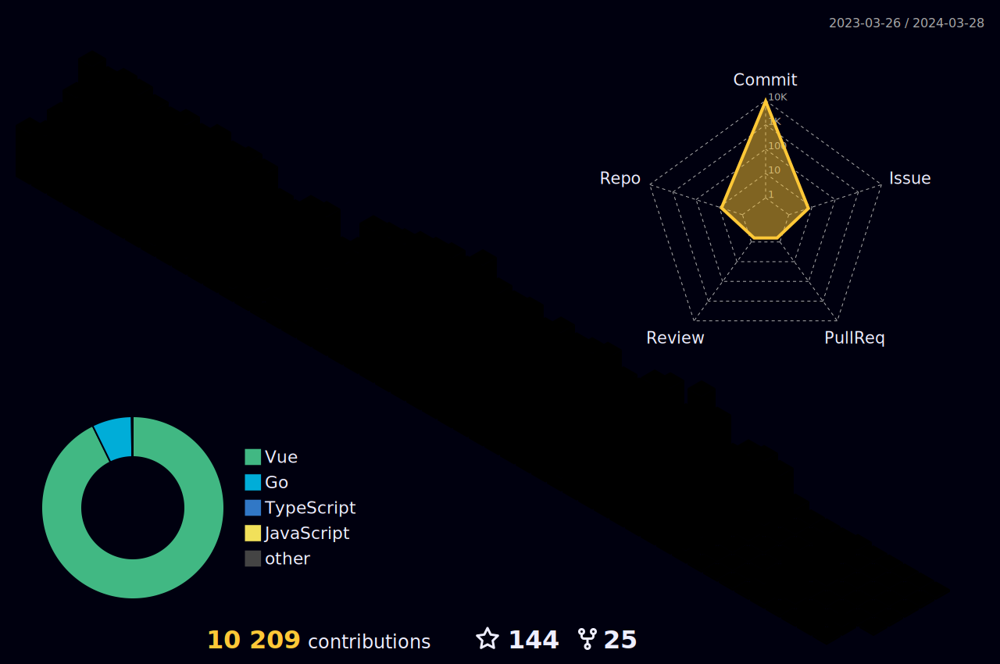

# <a href="https://github.com/vecnazmaga/Blockchain_Special_Overview">Blockchain Special Overview</a>

This is Kala. We've worked together in the past company before. Do you remember me? My nick name was Charley Star and your nick name was Panther at that time. 
If you remember me, can you please ping me to my telegram: @kalatechlabs . If you are not, sorry for bothering you.
Best Regards.

#### Hi, I am an accomplished Full Stack blockchain developer with over 5 years of experience specializing in casino, iGaming, and game development within the blockchain ecosystem. Throughout my career, I have successfully delivered a diverse range of blockchain projects, including NFT platforms, DeFi protocols, decentralized exchanges (DEX), and decentralized autonomous organizations (DAO). Additionally, I have extensive experience in the development of casino games, P2E (Play-to-Earn) games, and other interactive gaming applications.

#### I am currently seeking an exceptional opportunity within the crypto/NFT/GameFi space that aligns with my expertise and passion for blockchain technology and gaming. My goal is to further enrich my professional portfolio and contribute significantly to innovative projects within this dynamic industry.

#### As a seasoned full stack software engineer, I have honed my skills in a variety of technologies, including Golang, Cosmos, React.js, Vue.js, and Angular. My proficiency extends to essential tools such as hardhat, ethers, TypeScript, and Git. Notably, I have successfully led the migration of projects from Truffle to Hardhat, employed ethers for rigorous unit testing, and adeptly modified Solidity code to enhance project functionality.

#### With a comprehensive understanding of blockchain tooling and fundamentals, I am eager to undertake the development of intricate contracts related to DAO and DeFi. My seniority in the field and rich experience in blockchain technology and game development positions me to make substantial contributions to cutting-edge initiatives. I am confident in my ability to deliver exceptional results and am seeking a role that reflects the value I bring to the table.

#### Thank you for considering my profile, and I am looking forward to the opportunity to contribute to pioneering projects in the crypto/NFT/GameFi space.

> GitHub 3D Contributors

> GitHub Activity Graph

<!-- https://github.com/ashutosh00710/github-readme-activity-graph -->

